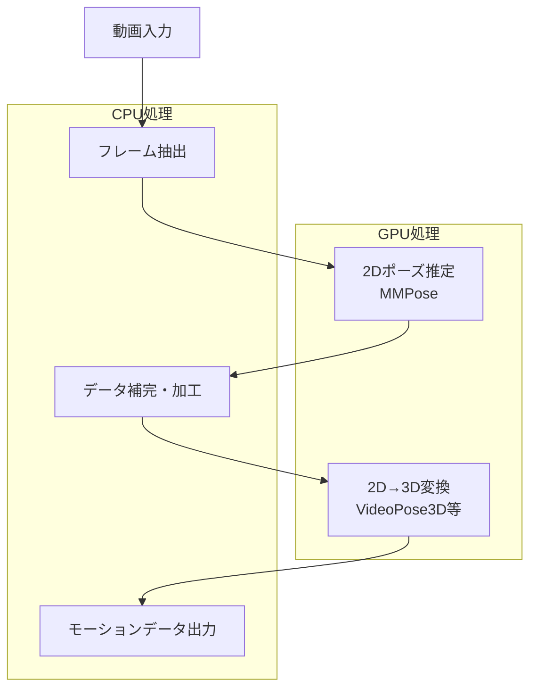
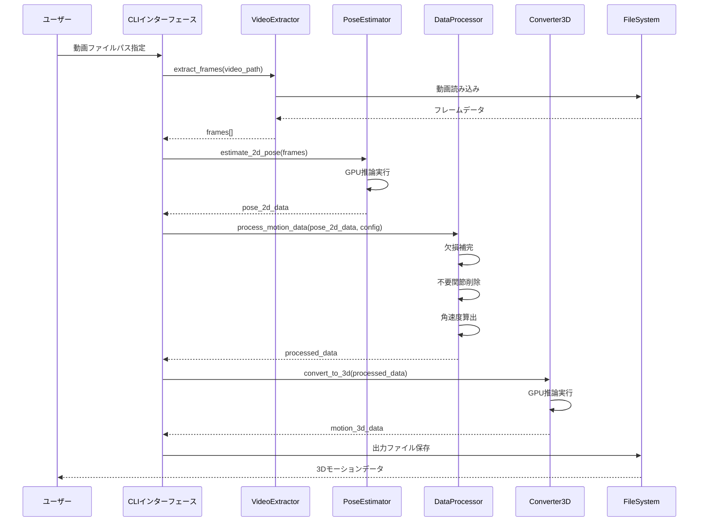

# 設計ドキュメント: Video Motion Extraction

## 概要

本機能は、人間の動きを含む動画（例：野球のバッターのスイング）からモーションデータを抽出し、加工・補完処理を行い、最終的に2Dから3Dフォーマットへ変換するツールを提供します。

MMPoseなどのGPUを活用するOSSライブラリを組み合わせ、AWS EC2上での本番運用を想定した設計となっています。主な処理フローは、動画入力 → 2Dポーズ推定 → データ補完・加工 → 3D変換 → 出力の5段階で構成されます。

## アーキテクチャ



## シーケンス図

### メイン処理フロー



## コンポーネントとインターフェース

### Component 1: VideoExtractor（動画フレーム抽出）

**目的**: 入力動画からフレームを抽出し、ポーズ推定に適した形式に変換する

**インターフェース**:
```python
class VideoExtractor:
    def __init__(self, config: ExtractorConfig) -> None:
        """
        Args:
            config: フレーム抽出設定（FPS、解像度など）
        """
        pass
    
    def extract_frames(self, video_path: str) -> List[np.ndarray]:
        """動画からフレームを抽出
        
        Args:
            video_path: 入力動画のパス
            
        Returns:
            フレーム画像のリスト（BGR形式）
        """
        pass
    
    def get_video_metadata(self, video_path: str) -> VideoMetadata:
        """動画のメタデータを取得"""
        pass
```

**責務**:
- 動画ファイルの読み込みとバリデーション
- 指定FPSでのフレーム抽出
- フレームのリサイズ・正規化

### Component 2: PoseEstimator（2Dポーズ推定）

**目的**: MMPoseを使用して各フレームから2D人体ポーズを推定する

**インターフェース**:
```python
class PoseEstimator:
    def __init__(self, model_config: PoseModelConfig) -> None:
        """
        Args:
            model_config: MMPoseモデル設定
        """
        pass
    
    def estimate_2d_pose(self, frames: List[np.ndarray]) -> Pose2DSequence:
        """フレームシーケンスから2Dポーズを推定
        
        Args:
            frames: 入力フレームのリスト
            
        Returns:
            2Dポーズシーケンス（関節座標と信頼度）
        """
        pass
    
    def detect_person(self, frame: np.ndarray) -> List[BoundingBox]:
        """フレーム内の人物を検出"""
        pass
```

**責務**:
- MMPoseモデルの初期化とGPU設定
- バッチ処理による効率的な推論
- 複数人物の検出と追跡

### Component 3: DataProcessor（データ補完・加工）

**目的**: 推定された2Dポーズデータの補完、フィルタリング、派生データの算出を行う

**インターフェース**:
```python
class DataProcessor:
    def __init__(self, processing_config: ProcessingConfig) -> None:
        """
        Args:
            processing_config: 加工処理設定
        """
        pass
    
    def interpolate_missing(self, pose_data: Pose2DSequence) -> Pose2DSequence:
        """欠損データの補完"""
        pass
    
    def remove_joints(self, pose_data: Pose2DSequence, 
                      joints_to_remove: List[str]) -> Pose2DSequence:
        """不要な関節の削除"""
        pass
    
    def calculate_angular_velocity(self, pose_data: Pose2DSequence) -> AngularVelocityData:
        """角速度の算出"""
        pass
    
    def smooth_trajectory(self, pose_data: Pose2DSequence, 
                          window_size: int) -> Pose2DSequence:
        """軌跡のスムージング"""
        pass
```

**責務**:
- 低信頼度データの補完（線形補間、スプライン補間）
- 指定関節の削除（手の細かい関節など）
- 角速度・加速度の算出
- ノイズ除去とスムージング

### Component 4: Converter3D（2D→3D変換）

**目的**: 2Dポーズデータを3Dモーションデータに変換する

**インターフェース**:
```python
class Converter3D:
    def __init__(self, model_config: Converter3DConfig) -> None:
        """
        Args:
            model_config: 3D変換モデル設定（VideoPose3D等）
        """
        pass
    
    def convert_to_3d(self, pose_2d: Pose2DSequence) -> Motion3DData:
        """2Dポーズを3Dモーションに変換
        
        Args:
            pose_2d: 2Dポーズシーケンス
            
        Returns:
            3Dモーションデータ
        """
        pass
    
    def export(self, motion_data: Motion3DData, 
               output_path: str, format: str) -> None:
        """指定フォーマットでエクスポート"""
        pass
```

**責務**:
- VideoPose3D等のモデルによる3D推定
- 複数出力フォーマットのサポート（BVH、FBX、JSON）
- スケール・座標系の調整
- ルートモーション復元（Hip中心化で失われたグローバル移動量の再注入）
- グローバル傾き補正（単眼深度推定由来の全身傾きをロドリゲスの回転公式で補正）
- 3Dテンポラルスムージング（時間軸ガウシアンフィルタによるジッター除去）

### 3D後処理パイプライン（Converter3D内部）

```
VideoPose3D推論出力 (Hip相対, Y-down)
  ↓ 人体スケール正規化 (target_height=1.7m)
  ↓ ルートモーション復元 (2D Hip軌跡 × root_motion_scale)
  ↓ Y軸反転 (Y-down → Y-up)
  ↓ 接地補正 (min(Y)=0)
  ↓ グローバル傾き補正 (>8°の場合、自然傾斜8°を残す)
  ↓ 3Dテンポラルスムージング (gaussian_filter, sigma=[σ, 0, 0])
  ↓ 接地再調整 (スムージング境界効果による負Y補正)
  ↓ クォータニオン回転計算
```

**ルートモーション復元アルゴリズム**:
- Hip中心化前の2D Hip軌跡を保存
- 3D出力のX,Y座標に `hip_2d_trajectory * root_motion_scale` を加算
- `root_motion_scale`（デフォルト2.5）で単眼カメラの視差圧縮を補正

**グローバル傾き補正アルゴリズム**:
- 全フレーム平均のHip→Thorax方向ベクトルを算出
- 垂直(Y-up)との角度が8°超の場合、ロドリゲスの回転公式で補正
- 回転軸 = cross(avg_spine, vertical)、補正角 = tilt - 8°
- Hip中心で回転し、接地を再調整

## データモデル

### VideoMetadata

```python
@dataclass
class VideoMetadata:
    width: int              # フレーム幅
    height: int             # フレーム高さ
    fps: float              # フレームレート
    total_frames: int       # 総フレーム数
    duration: float         # 動画長（秒）
    codec: str              # コーデック情報
```

**バリデーションルール**:
- width, height > 0
- fps > 0
- total_frames >= 1

### Pose2DSequence

```python
@dataclass
class Pose2DSequence:
    frames: List[Pose2DFrame]   # フレームごとのポーズデータ
    joint_names: List[str]      # 関節名のリスト
    fps: float                  # フレームレート
    
@dataclass
class Pose2DFrame:
    frame_id: int                           # フレーム番号
    keypoints: np.ndarray                   # 関節座標 (N, 2)
    confidence: np.ndarray                  # 信頼度 (N,)
    bounding_box: Optional[BoundingBox]     # 検出領域
```

**バリデーションルール**:
- keypoints.shape[0] == len(joint_names)
- 0 <= confidence <= 1
- frame_id >= 0

### Motion3DData

```python
@dataclass
class Motion3DData:
    frames: List[Motion3DFrame]     # フレームごとの3Dデータ
    joint_names: List[str]          # 関節名
    joint_hierarchy: Dict[str, str] # 親子関係
    fps: float                      # フレームレート
    
@dataclass
class Motion3DFrame:
    frame_id: int                   # フレーム番号
    positions: np.ndarray           # 3D位置 (N, 3)
    rotations: np.ndarray           # 回転（クォータニオン） (N, 4)
```

### ProcessingConfig

```python
@dataclass
class ProcessingConfig:
    interpolation_method: str = "spline"    # 補間方法
    confidence_threshold: float = 0.3       # 信頼度閾値
    smoothing_window: int = 5               # スムージング窓サイズ
    joints_to_remove: List[str] = field(default_factory=list)
```

## アルゴリズム擬似コード

### メイン処理アルゴリズム

```pascal
ALGORITHM process_video_to_3d_motion(video_path, config)
INPUT: video_path: 動画ファイルパス, config: 処理設定
OUTPUT: motion_3d: 3Dモーションデータ

BEGIN
  ASSERT file_exists(video_path) = true
  ASSERT is_valid_video(video_path) = true
  
  // Step 1: 動画からフレーム抽出
  extractor ← VideoExtractor(config.extractor_config)
  frames ← extractor.extract_frames(video_path)
  
  ASSERT length(frames) > 0
  
  // Step 2: 2Dポーズ推定（GPU処理）
  estimator ← PoseEstimator(config.pose_config)
  pose_2d ← estimator.estimate_2d_pose(frames)
  
  ASSERT pose_2d.frames IS NOT EMPTY
  
  // Step 3: データ補完・加工
  processor ← DataProcessor(config.processing_config)
  
  // 3.1 欠損データ補完
  pose_2d ← processor.interpolate_missing(pose_2d)
  
  // 3.2 不要関節削除
  IF config.joints_to_remove IS NOT EMPTY THEN
    pose_2d ← processor.remove_joints(pose_2d, config.joints_to_remove)
  END IF
  
  // 3.3 スムージング
  pose_2d ← processor.smooth_trajectory(pose_2d, config.smoothing_window)
  
  // 3.4 角速度算出（オプション）
  IF config.calculate_angular_velocity THEN
    angular_data ← processor.calculate_angular_velocity(pose_2d)
  END IF
  
  // Step 4: 2D→3D変換（GPU処理）
  converter ← Converter3D(config.converter_config)
  motion_3d ← converter.convert_to_3d(pose_2d)
  
  ASSERT motion_3d.frames IS NOT EMPTY
  ASSERT motion_3d.fps = pose_2d.fps
  
  RETURN motion_3d
END
```

**事前条件:**
- video_pathは有効な動画ファイルを指す
- configは必要な設定をすべて含む
- GPUが利用可能（CUDA対応）

**事後条件:**
- motion_3dは有効な3Dモーションデータを含む
- 出力フレーム数は入力フレーム数と一致
- すべての関節データが有効な値を持つ

### 欠損データ補完アルゴリズム

```pascal
ALGORITHM interpolate_missing_keypoints(pose_sequence, threshold)
INPUT: pose_sequence: 2Dポーズシーケンス, threshold: 信頼度閾値
OUTPUT: interpolated_sequence: 補完済みシーケンス

BEGIN
  FOR each joint_idx IN range(num_joints) DO
    // 各関節について時系列データを取得
    keypoints ← extract_joint_timeseries(pose_sequence, joint_idx)
    confidences ← extract_confidence_timeseries(pose_sequence, joint_idx)
    
    // 低信頼度フレームを特定
    missing_frames ← []
    valid_frames ← []
    
    FOR frame_idx IN range(length(keypoints)) DO
      IF confidences[frame_idx] < threshold THEN
        missing_frames.append(frame_idx)
      ELSE
        valid_frames.append(frame_idx)
      END IF
    END FOR
    
    // ループ不変条件: valid_frames + missing_frames = 全フレーム
    ASSERT length(valid_frames) + length(missing_frames) = length(keypoints)
    
    // 補間実行
    IF length(valid_frames) >= 2 AND length(missing_frames) > 0 THEN
      interpolated ← spline_interpolate(
        valid_frames, 
        keypoints[valid_frames], 
        missing_frames
      )
      
      // 補間値を適用
      FOR i, frame_idx IN enumerate(missing_frames) DO
        keypoints[frame_idx] ← interpolated[i]
        confidences[frame_idx] ← INTERPOLATED_CONFIDENCE
      END FOR
    END IF
    
    // 結果を反映
    update_joint_timeseries(pose_sequence, joint_idx, keypoints, confidences)
  END FOR
  
  RETURN pose_sequence
END
```

**事前条件:**
- pose_sequenceは有効なポーズデータを含む
- 0 < threshold <= 1

**事後条件:**
- すべての欠損フレームが補間される（十分な有効フレームがある場合）
- 元の有効データは変更されない

**ループ不変条件:**
- 処理済み関節のデータは一貫性を保つ
- valid_framesとmissing_framesは重複しない

### 角速度算出アルゴリズム

```pascal
ALGORITHM calculate_angular_velocity(pose_sequence, fps)
INPUT: pose_sequence: 2Dポーズシーケンス, fps: フレームレート
OUTPUT: angular_velocities: 各関節の角速度データ

BEGIN
  dt ← 1.0 / fps
  num_frames ← length(pose_sequence.frames)
  angular_velocities ← empty_array(num_frames - 1, num_joints)
  
  FOR joint_idx IN range(num_joints) DO
    // 関節の親子関係から角度を計算
    parent_joint ← get_parent_joint(joint_idx)
    
    IF parent_joint IS NOT NULL THEN
      FOR frame_idx IN range(num_frames - 1) DO
        // 現在フレームと次フレームの角度
        angle_current ← calculate_joint_angle(
          pose_sequence.frames[frame_idx],
          joint_idx,
          parent_joint
        )
        angle_next ← calculate_joint_angle(
          pose_sequence.frames[frame_idx + 1],
          joint_idx,
          parent_joint
        )
        
        // 角速度 = 角度変化 / 時間
        angular_velocity ← (angle_next - angle_current) / dt
        
        // -π〜πの範囲に正規化
        angular_velocity ← normalize_angle(angular_velocity)
        
        angular_velocities[frame_idx, joint_idx] ← angular_velocity
        
        // ループ不変条件: 計算済みの角速度は有限値
        ASSERT is_finite(angular_velocity)
      END FOR
    END IF
  END FOR
  
  RETURN angular_velocities
END
```

**事前条件:**
- pose_sequenceは2フレーム以上を含む
- fps > 0

**事後条件:**
- angular_velocitiesの長さは入力フレーム数 - 1
- すべての角速度値は有限値

## 主要関数の形式仕様

### Function 1: extract_frames()

```python
def extract_frames(video_path: str, target_fps: Optional[float] = None) -> List[np.ndarray]:
    """動画からフレームを抽出する"""
    pass
```

**事前条件:**
- `video_path`は存在する有効な動画ファイルを指す
- `target_fps`が指定される場合、0より大きい値
- 動画ファイルは読み取り可能

**事後条件:**
- 戻り値は空でないリスト
- 各フレームは(H, W, 3)形状のnumpy配列（BGR形式）
- フレーム数は動画長とFPSから計算される値と一致

### Function 2: estimate_2d_pose()

```python
def estimate_2d_pose(frames: List[np.ndarray], batch_size: int = 32) -> Pose2DSequence:
    """フレームシーケンスから2Dポーズを推定する"""
    pass
```

**事前条件:**
- `frames`は空でないリスト
- 各フレームは有効な画像データ（3チャンネル、正の寸法）
- GPUメモリが十分に利用可能

**事後条件:**
- 戻り値のフレーム数は入力フレーム数と一致
- 各フレームのkeypointsは(N, 2)形状
- confidenceは[0, 1]の範囲

### Function 3: convert_to_3d()

```python
def convert_to_3d(pose_2d: Pose2DSequence) -> Motion3DData:
    """2Dポーズシーケンスを3Dモーションデータに変換する"""
    pass
```

**事前条件:**
- `pose_2d`は有効なポーズシーケンス
- 入力データは補完・正規化済み
- 必要な関節がすべて含まれている

**事後条件:**
- 戻り値のフレーム数は入力と一致
- 各フレームのpositionsは(N, 3)形状
- rotationsは正規化されたクォータニオン

## 使用例

```python
# 基本的な使用例
from video_motion_extraction import MotionExtractor

# 設定
config = ExtractorConfig(
    target_fps=30.0,
    pose_model="mmpose_hrnet",
    converter_model="videopose3d",
    joints_to_remove=["left_hand_*", "right_hand_*"],  # 手の細かい関節を除外
    output_format="bvh"
)

# 抽出器の初期化
extractor = MotionExtractor(config)

# 動画からモーションデータを抽出
motion_data = extractor.process("baseball_swing.mp4")

# 角速度データも取得
angular_velocity = extractor.get_angular_velocity()

# 出力
extractor.export(motion_data, "output/swing_motion.bvh")

# バッチ処理の例
video_files = ["video1.mp4", "video2.mp4", "video3.mp4"]
for video in video_files:
    motion = extractor.process(video)
    extractor.export(motion, f"output/{Path(video).stem}.bvh")
```

## 正当性プロパティ

以下の性質がシステム全体で保証される：

1. **フレーム数の保存**: ∀ input_video: 出力モーションデータのフレーム数 = 入力動画のフレーム数（指定FPSで）

2. **関節データの完全性**: ∀ frame ∈ output: すべての関節が有効な3D座標を持つ

3. **時間的一貫性**: ∀ consecutive_frames (f1, f2): 関節位置の変化が物理的に妥当な範囲内

4. **信頼度の単調性**: 補完処理後、低信頼度フレームの信頼度は元の値以上

5. **座標系の一貫性**: 出力データの座標系は指定されたフォーマットの規約に従う

## エラーハンドリング

### Error Scenario 1: 動画ファイル読み込みエラー

**条件**: 動画ファイルが存在しない、または破損している
**対応**: `VideoLoadError`を発生させ、詳細なエラーメッセージを提供
**復旧**: ユーザーに有効なファイルパスの指定を促す

### Error Scenario 2: 人物検出失敗

**条件**: フレーム内に人物が検出されない
**対応**: 警告をログに記録し、該当フレームをスキップ
**復旧**: 前後のフレームから補間を試みる。連続して検出失敗が続く場合は処理を中断

### Error Scenario 3: GPUメモリ不足

**条件**: バッチサイズが大きすぎてGPUメモリが不足
**対応**: バッチサイズを自動的に縮小して再試行
**復旧**: 最小バッチサイズでも失敗する場合は`GPUMemoryError`を発生

### Error Scenario 4: 3D変換の品質低下

**条件**: 2Dポーズの品質が低く、3D変換結果が不安定
**対応**: 品質スコアを計算し、閾値以下の場合は警告
**復旧**: スムージングパラメータを調整して再処理を提案

## テスト戦略

### ユニットテストアプローチ

- 各コンポーネント（VideoExtractor, PoseEstimator, DataProcessor, Converter3D）を個別にテスト
- モックを使用してGPU依存部分を分離
- エッジケース（空の入力、単一フレーム、極端に長い動画）をカバー

### プロパティベーステストアプローチ

**プロパティテストライブラリ**: hypothesis

```python
from hypothesis import given, strategies as st

@given(st.lists(st.floats(min_value=0, max_value=1), min_size=10, max_size=100))
def test_interpolation_preserves_valid_data(confidence_values):
    """補間処理が有効なデータを変更しないことを検証"""
    # 有効なデータポイントは補間後も同じ値を保持
    pass

@given(st.integers(min_value=1, max_value=1000))
def test_frame_count_preservation(num_frames):
    """フレーム数が処理を通じて保存されることを検証"""
    pass
```

### 統合テストアプローチ

- サンプル動画を使用したエンドツーエンドテスト
- 出力フォーマットの妥当性検証
- 既知の動作との比較テスト

## パフォーマンス考慮事項

- **バッチ処理**: GPU利用効率を最大化するため、フレームをバッチで処理
- **メモリ管理**: 大きな動画は分割して処理し、メモリ使用量を制限
- **並列処理**: CPU処理（フレーム抽出、データ加工）とGPU処理（推論）をパイプライン化
- **キャッシング**: 中間結果をキャッシュして再処理を高速化

## セキュリティ考慮事項

- **入力検証**: 動画ファイルのフォーマットとサイズを検証
- **パス検証**: ファイルパスのトラバーサル攻撃を防止
- **リソース制限**: 処理時間とメモリ使用量に上限を設定

## 依存関係

| ライブラリ | バージョン | 用途 |
|-----------|-----------|------|
| MMPose | >= 1.0.0 | 2Dポーズ推定 |
| VideoPose3D | latest | 2D→3D変換 |
| OpenCV | >= 4.5.0 | 動画処理 |
| NumPy | >= 1.20.0 | 数値計算 |
| SciPy | >= 1.7.0 | 補間・フィルタリング |
| PyTorch | >= 1.10.0 | GPU推論 |
| CUDA | >= 11.0 | GPU計算 |
